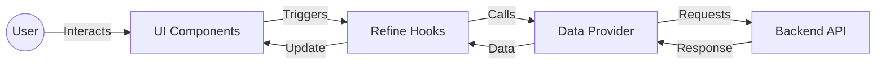

# Classroom Frontend


A modern, robust frontend for a Classroom Management System, built with **React 19**, **Refine**, and **Tailwind CSS**. This application provides a seamless interface for managing classes, subjects, and viewing dashboard analytics.

## 📋 Table of Contents

- [Features](#-features)
- [Way of Working](#-way-of-working)
- [Project Structure](#-project-structure)
- [Installation Script](#-installation-script)
- [Tech Stack](#-tech-stack)

## ✨ Features

- **Dashboard**: Overview of system statistics.
- **Class Management**: Create, read, update, and delete class records.
- **Subject Management**: Manage subjects and their details.
- **Responsive Design**: Fully responsive UI built with Tailwind CSS and Radix UI primitives.
- **Data Handling**: Efficient data fetching and state management using Refine.

## 🔄 Way of Working

The application follows a structured data flow centered around Refine's architecture.



1.  **Entry Point**: The application starts at `src/index.tsx`, which mounts the `App` component.
2.  **Routing**: `App.tsx` configures the Refine resources (`dashboard`, `classes`, `subjects`) and routes.
3.  **UI Data**: Pages use Refine hooks (e.g., `useList`, `useForm`) to interact with the data layer.
4.  **Data Provider**: `src/providers/data.ts` acts as the bridge between the frontend and the backend API, standardizing requests and responses.

## 📂 Project Structure

| Path              | Description                                    |
| :---------------- | :--------------------------------------------- |
| `src/`            | Source code root                               |
| `├── components/` | Reusable UI components (Shadcn/Radix UI)       |
| `├── constants/`  | Application-wide constants                     |
| `├── hooks/`      | Custom React hooks                             |
| `├── lib/`        | Utility functions and helpers                  |
| `├── pages/`      | Page components (Dashboard, Classes, Subjects) |
| `├── providers/`  | Refine data and auth providers                 |
| `├── types/`      | TypeScript type definitions                    |
| `├── App.tsx`     | Main application component and routing setup   |
| `├── App.css`     | Global styles                                  |
| `└── index.tsx`   | Application entry point                        |

## 🚀 Installation Script

Follow these steps to set up the project locally.

**Prerequisites**: Node.js (v18+) and npm/pnpm.

1.  **Clone the repository** (if applicable) or navigate to the project directory.

2.  **Install Dependencies**:

    ```bash
    npm install
    # or
    pnpm install
    ```

3.  **Run Development Server**:

    ```bash
    npm run dev
    # or
    pnpm dev
    ```

4.  **Build for Production**:
    ```bash
    npm run build
    ```

## 🛠 Tech Stack

**Core**

- [React 19](https://react.dev/) - UI Library
- [TypeScript](https://www.typescriptlang.org/) - Static Typing
- [Vite](https://vitejs.dev/) - Build Tool

**Framework & State**

- [Refine](https://refine.dev/) - React Framework for internal tools

**Styling & UI**

- [Tailwind CSS](https://tailwindcss.com/) - Utility-first CSS
- [Radix UI](https://www.radix-ui.com/) - Headless UI Primitives
- [Shadcn UI](https://ui.shadcn.com/) - Reusable components
- [Lucide React](https://lucide.dev/) - Icons

**Validation & Forms**

- [Zod](https://zod.dev/) - Schema Validation
- [React Hook Form](https://react-hook-form.com/) - Form Management
